# Class Assignment 4 - Part 1

# Docker - Containerization

#### In this Assignment we're going to utilize docker to run two containers. One will be used to run the Spring application and the other one will be used to run the database.

### For this tutorial it is assumed that you already followed the steps from the DEVOPS class and installed Docker in your computer.

Regarding this tutorial I can only say:


# 1. Take a look at the teacher's repository (This one is easy)

**1.1.** First, let's look at the teacher's repository to study the Readme file and see what is needed to do regarding the dockerfiles and the docker-compose.yml.

**1.2.** Copy the contents of the web and db dockerfiles to your working directory.

**1.3.** Do the same with the docker-compose.yml file.

**1.4.** Create a copy of your CA3-Part2 assignment in your repository.

# 2. Setting up the Docker files.

**2.1.** Modify the _web_ dockerfile in order to have your repository and define the directory in which the gradlew file will be, in order to guarantee it can run the build successfully.

```dockerfile
RUN git clone https://Batista_Ricardo@bitbucket.org/Batista_Ricardo/devops-20-21.git

WORKDIR /tmp/build/devops-20-21/ca4/Part 1/demo

RUN chmod u+x gradlew
```


**2.2.** Now, let's bring the containers up.

Open the command line in the _docker-compose.yml_ file directory and run the following command:

```
docker-compose build
```

The result should look like this:

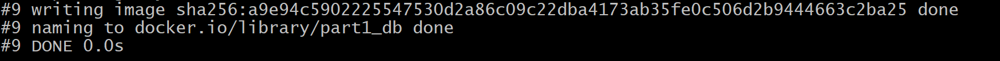


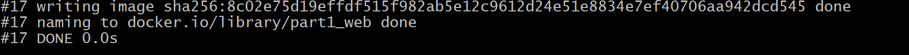

**2.3.** Now, let's make the containers run


```
docker-compose up
```

Something like this should appear:

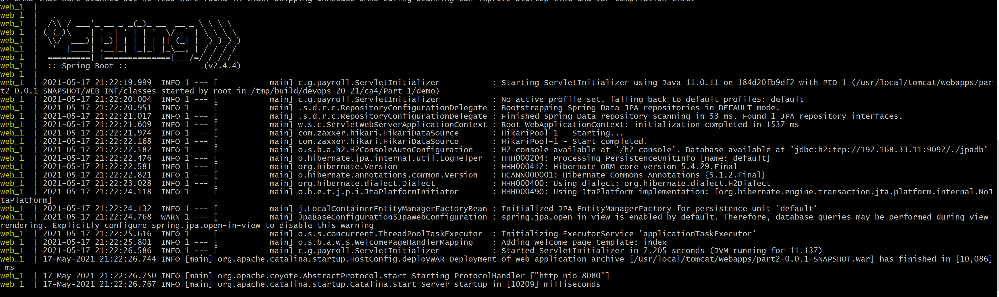

**2.4.** Let's confirm everything is okay on the frontend and h2 database:

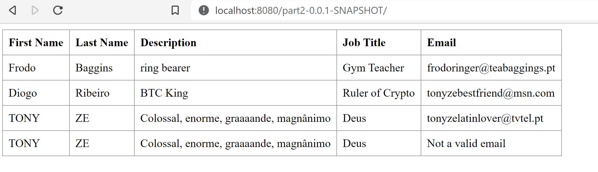

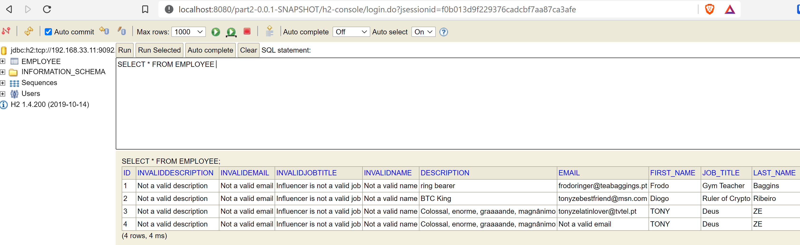

Everything works out!

# 3. Publish your images to Docker Hub (Don't mistake with another website that also ends in Hub).

**3.1.** First, let's login to Docker Hub. (If you don't have an account, go to https://hub.docker.com and register.). Type _docker login_ and use your credentials.

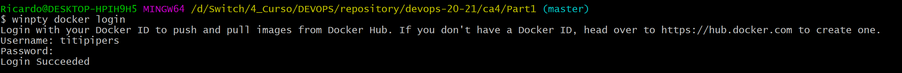

Now, let's publish our images. Verify the image names on the Docker GUI or you can use the command line to know which containers are running and info about them.

**3.2.** Type _docker images_ to verify the name of your images.

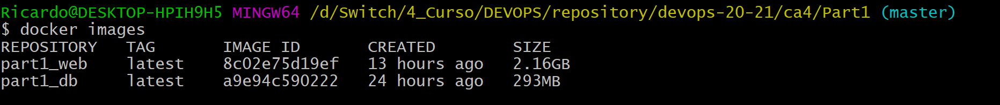

**3.3** Now, let's push the image to docker Hub:

First, let's create a tag for the images (_docker tag <image> < username >/< repository name >:< tag >_)

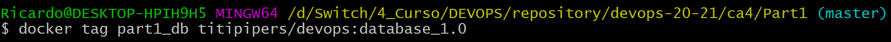

Then, use the _docker images_ command to check if the tag was created:

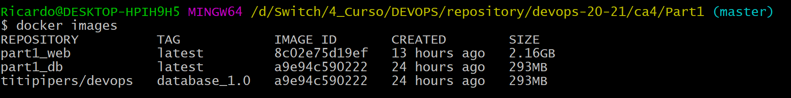

Finally, execute the push command:

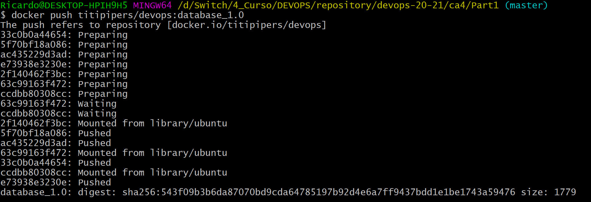

Now, we can check the remote repository:

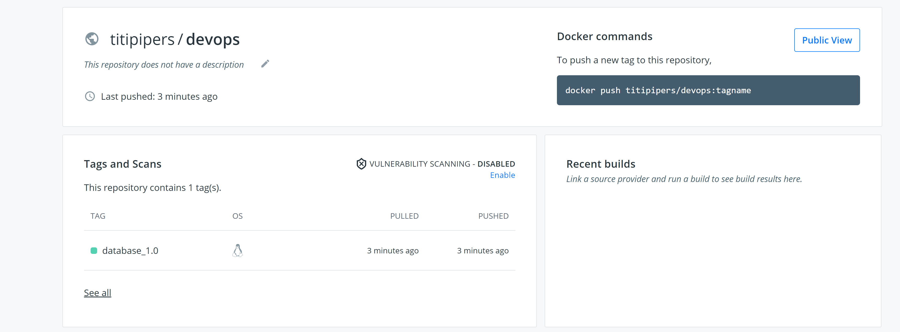

**3.4.** Repeat the steps for the other container (web).

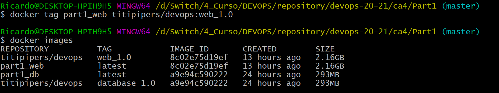

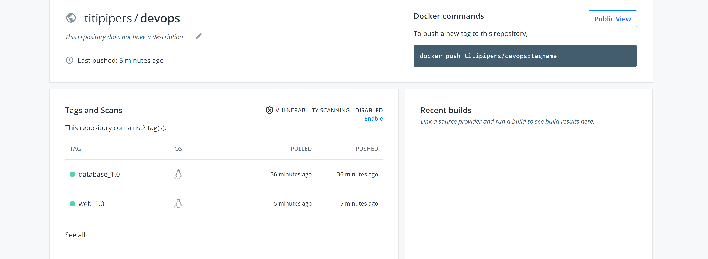

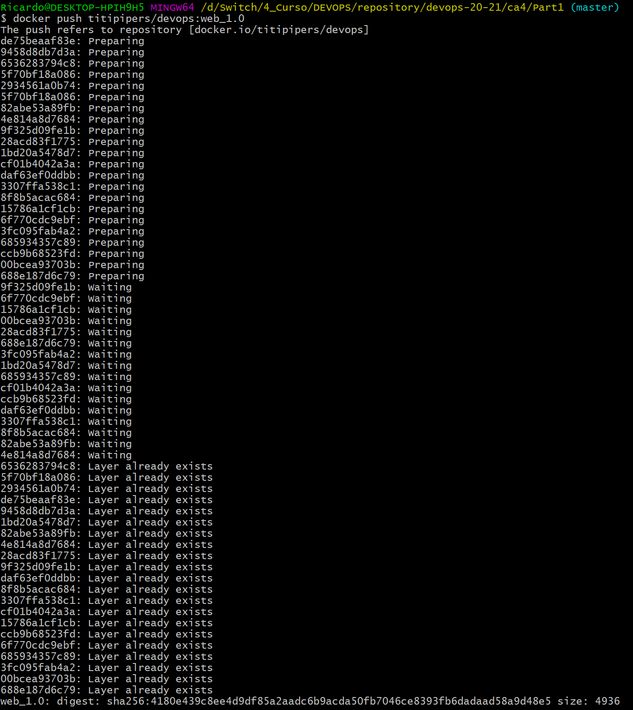

# 4. Copy the database file inside the container to a volume.

**4.1.** - Make sure your containers are running and view the containers ID's by typing _docker ps_.

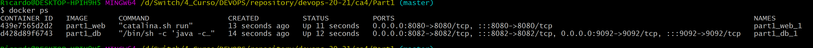

Now, use the following command to login to your db container:

```
winpty docker exec -it < container id > bash
```

This will open a command line inside your db container.

Now verify the contents using _ls -l_

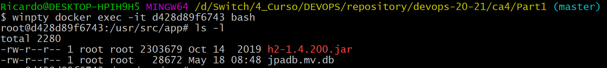

The file you're trying to copy is the _jpadb.mv.db_

**4.2** Copy the file to the volume defined in the _docker-compose.yml_

```
docker exec -it d428d89f6743 cp jpadb.mv.db /usr/src/data
```

For reasons unknown to mankind, the last command will only work in Windows OS if run in the PowerShell.

So, I urge you to change to the Powershell, navigate to the working directory and execute the command there.

Afterwards you can see that it copied the file to the intended directory:

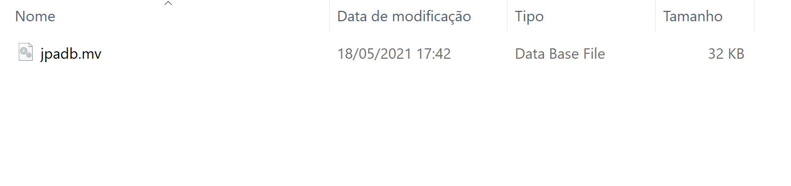

# 5. That's it! Thanks for keeping up! Now, since you didn't invest in Bitcoin around 2013 and now you have to make a living, working to others, let's keep that strong attitude and try to implement the "alternative" to Docker.

