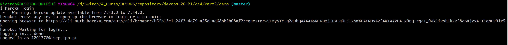

# Class Assignment 4 - Part 2

# Heroku

# In this part of the Class Assignment we're going to try to deploy the Containers to Heroku.

### Heroku is a container-based cloud Platform which is used by developers to deploy apps. It can also be used to manage and scale such apps. It is allegedly (let's not jump to conclusions) easy to use and flexible. One of the many advantages of using heroku is the fact of heroku accepts many languages. We could say that Heroku is polyglot!

(I know that polyglot seems like a word Zézé Camarinha would say)


As you will be able to see further ahead, the solution was not that easy (Has it ever been?)

So, stay tuned and never forget, just HODL Crypto and your life will be better.

DISCLAIMER: In order to complete this assignment you need to create an account at heroku (https://heroku.com)

# 1. Push our code to heroku in order to build an application

**1.1.** Let's try the simplest approach.

You're an amazing dev and by the looks of it you have this amazing piece of code that you want to make into an app.

So, you create everything (You probably just copied it from someone else, let's face it) and now let's try to push it to heroku.

**1.2.** Create an application inside your heroku account.


**1.3.** Now associate that application to your already existing git repository:

```
heroku git:remote -a ca4-part2
```

**1.4.** Now let's push the code to heroku!

````
git subtree push --prefix ca4/Part2/demo heroku master
````

**1.5.** Great! Now let's go to the generated app and look at it:

https://ca4-part2/herokuapp.com


Oops...Something went wrong! Let's look at the error:


# So, in summary it doesn't work!

# 2. Let's try a different approach.

**2.1.** Let's follow the https://devcenter.heroku.com/articles/container-registry-and-runtime tutorial.

**2.2** Open the command line and log in to Container Registry:

``
heroku container:login
``

**2.3.** Now create the app in heroku:

````
heroku create
````

**2.4.** Now go to the directory of your web Dockerfile and push it:

````
heroku container:push web
````


**2.5.** Now release the container:

````
heroku container:release web
````


**2.6.** Now for the big finale! Let's open the app in the browser:

````
heroku open
````

aaaaaaand...


When we look at ther error it is quite big and complicated...


# 3. Third attempt!

I've been searching and there is a way to deploy both containers to heroku but we do have a limitation of 1gb. And both containers are way bigger than that:


So, there is a way to reduce the image size in order to possibly make this work, which is using _docker build --squash_!

But guess what happens when we try to run that command?


So, we'll try one last solution.

# 4. WAR! The solution is WAR! No, we're not suddendly americans!

**4.1.** The working solution will go through the deployment of the war file.

**4.2.** But first we have to make some changes in order to guarantee the database is running on memory:


**4.2.1** Go to _application.properties_ and remove comment from in-memory database and comment the "persistent" database url.

```properties
server.servlet.context-path=/part2-0.0.1-SNAPSHOT
spring.data.rest.base-path=/api
spring.datasource.url=jdbc:h2:mem:jpadb
# In the following settings the h2 file is created in /home/vagrant folder
#spring.datasource.url=jdbc:h2:tcp://192.168.33.11:9092/./jpadb;DB_CLOSE_DELAY=-1;DB_CLOSE_ON_EXIT=FALSE
```

**4.2.2** Change the get path from App.js file: 

```Javascript
componentDidMount() { // <2>
		client({method: 'GET', path: '/api/employees'}).done(response => {
			this.setState({employees: response.entity._embedded.employees});
		});
	}
```

**4.2.3.** After executing the changes commit and push.

**4.3.** Now, let's go to the application directory and execute login in heroku:

````
heroku login
````


**4.4.** Build your application using _./gradlew build_

**4.5.** Now, install the Heroku Java plugin:

```
heroku plugin:install java
```


**4.6.** And now the _pièce de résistance_, deploying war to heroku!

In order to not create confusion I've created a new app in my heroku account named _war-deploy-devops_:


To deploy the war file run the command:

````
heroku war:deploy <path_to_war_file> --app <app_name>
````


And now for the moment of truth:


IT WORKS! It is LIT!


That was a tough one! Thanks for staying there! 
#### We'll send you a Pedro Chagas Freitas book, to help you pass the time!

